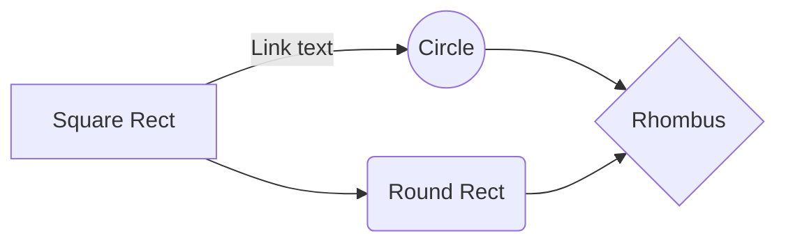

# FluidUI

It's unstyled components library created for Styled components library.

## Core Concepts

- Easy To Use
  - Functionality
  - Props default values
  - State management
- SSR Support
- WAI-ARIA Support
- I18n Support
- Event Key Support



https://react-spectrum.adobe.com/internationalized/date/Time.html https://stackedit.io/app#
{/*  */}

#### Formats

<Tabs items={['Format 1', 'Format 2', 'Format 3']}>
    <Tabs.Tab>
        ```ts
            {
                time:320330,
                timeUnit: 'seconds',
            }
        ```
    </Tabs.Tab>
</Tabs>
